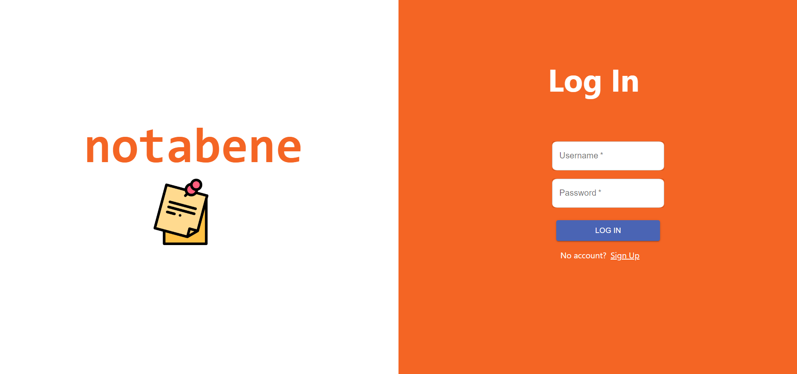
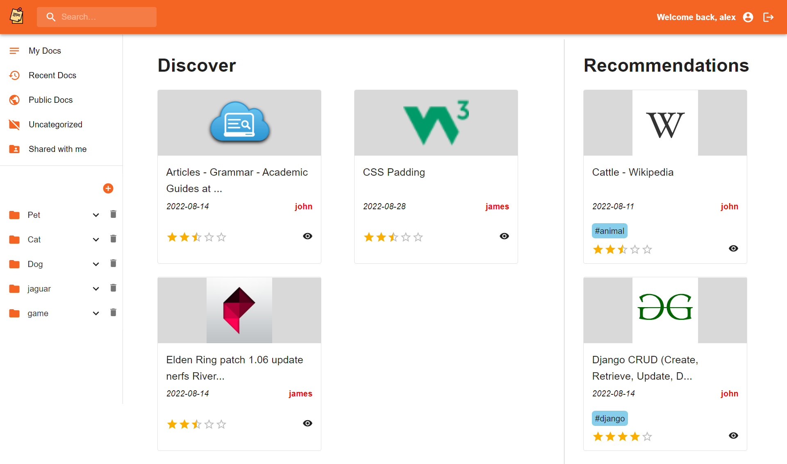
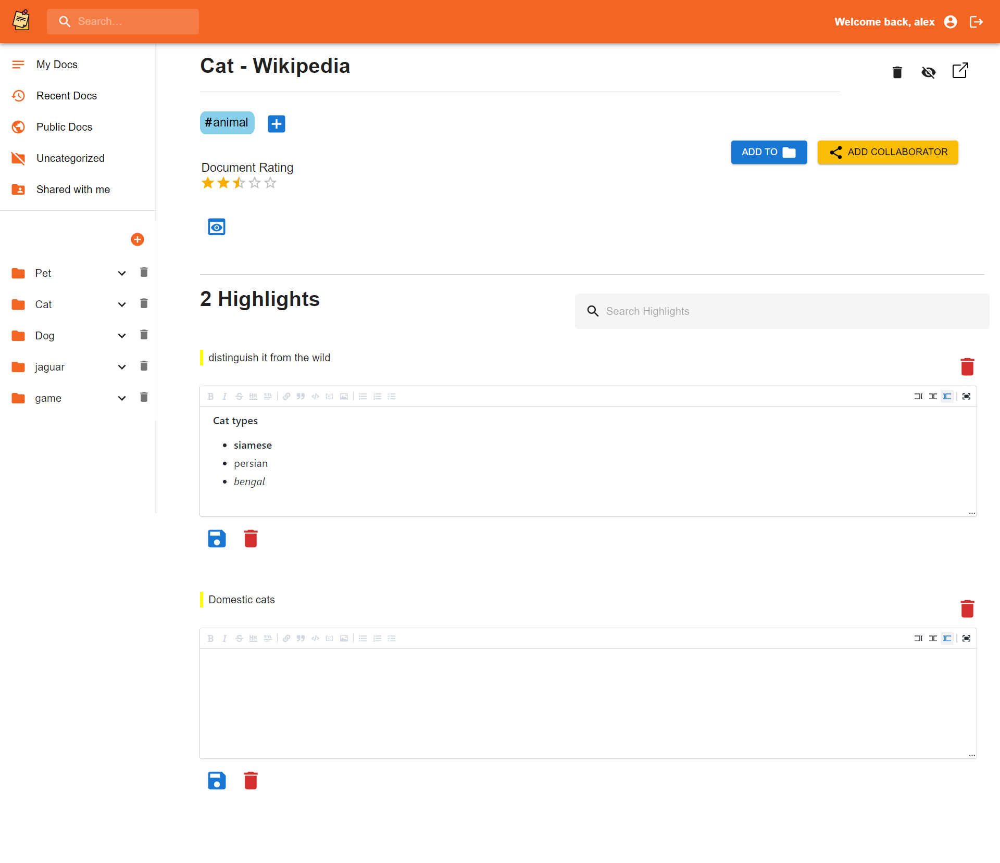
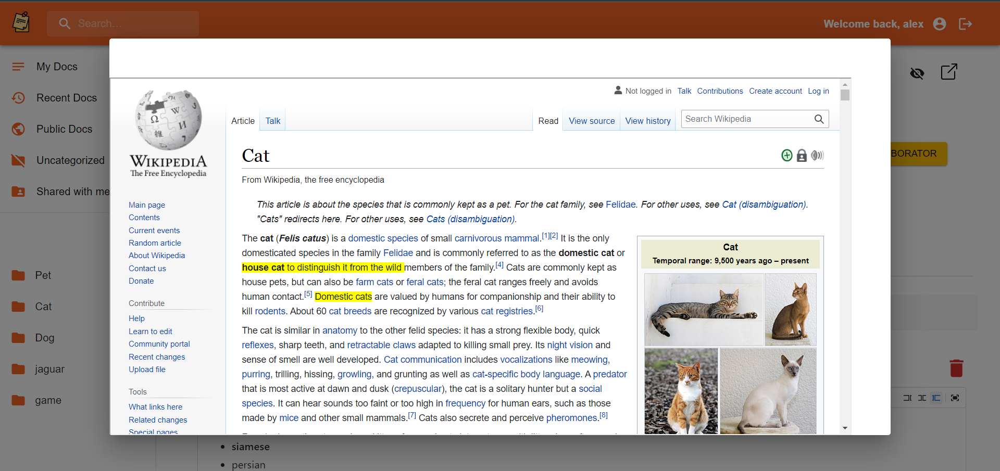

# Notabene
Notabene is a browser based knowledge management tool. It basically consists of a **browser extension** to highlight texts and take notes from webpages and a **website** to manage them.

## Tech Stack
- Django REST Framework
- React
- Chrome Extension Manifest V3
- PostgreSQL

## Functionalities
* ### Extension 
  * Highlight texts in any webpage you read on the internet 🖋️
  * Take notes corresponding to each highlight 🗒️

 
* ### Website
  * View and edit *documents* (Here, "document" refers to a set of highlights and notes of a webpage) 📓
  * View source webpage of a document in the website 📜
  * Add personalized rich text notes to the highlights 📝
  * Add tags to a document 🔖
  * Set privacy of a document (public/private) 🚫
  * Categorize documents based on folders 📁
  * Collaborate with other users in editing documents 👋
  * Share private documents with selective users 📧
  * Collaboration and share request will be sent through e-mail 📫
  * Rate other documents ⭐
  * Trending documents will be shown in feed ⚡
  * Document recommendation 📚
  * Search through public documents and highlights inside a document 🔍

